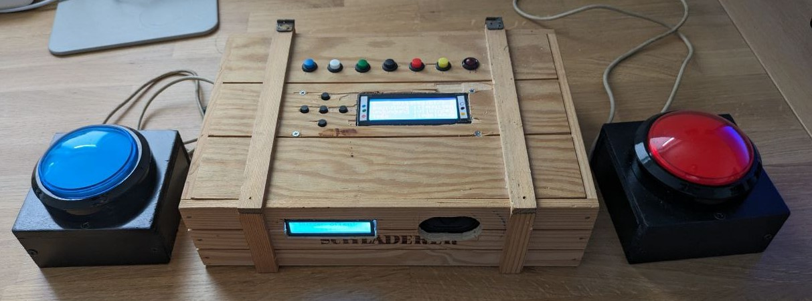
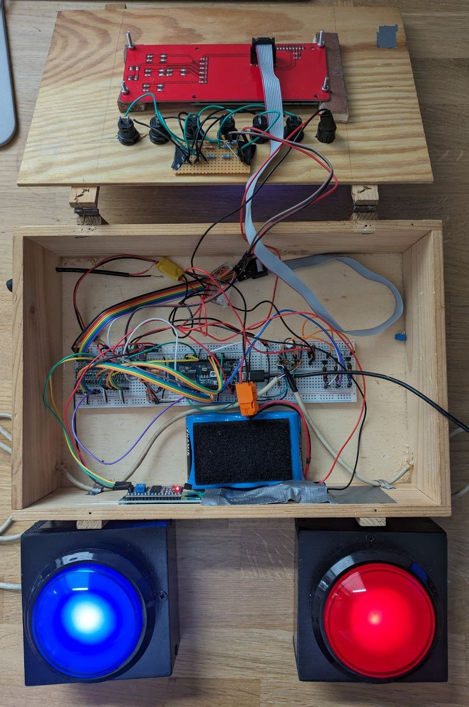

# Gameshow Buzzer and Soundboard



## Introduction
This is a fun project for a "device" used to play quizzes with two buzzers (first one pressed lights up).
It's also used as soundboard (you want to insult a player? Just press a button for that).
The sounds are stored as WAV on an SD card.
As I had a 20x4 LCD with navigation buttons left over from my Anet A8 printer, it's got a little menu to navigate through soundboard
pages and configure some stuff.
Sounds are played over a cheap speaker connected to an I2S amplifier.

## Hardware


Most parts are either leftovers I had or items that can be bought online for a small price. 
Most of them can be replaced by similar components.
 - ESP32 from [here](https://github.com/FKainka/NodeESP_Firmware) (just use any you got lying around)
 - 5V LCD1602 with I2C interface (actually a bit useless)
 - Max98357 I2S 3W Class D Amplifier
 - 6pcs Self-Lock /Momentary Pushbutton Switches DS228 DS428 12mm OFF- ON Push (colored)
 - JCD 1PCS Notebook Speaker Horn 2W 8R
 - 2x 100mm Big Round Push Button LED Illuminated with Microswitch for DIY Arcade Game Machine Parts 5/12V Large Dome Light Switch
 - 3A Mini DC-DC Buck Step Down Converter Board Module 5V-30V to 5V DC DC Voltage Regulator PCB Board Power Buck Module
 - 20x4 LCD from Anet A8 (schematic [here](https://github.com/ralf-e/ANET-3D-Board-V1.0)) 
 - Bidirectional level shifters 3.3V <-> 5V, must be suitable for I2C
 - Bread boards, cables, some transistors, resistors, caps
 - A large wooden box for the electronics and a small wooden box, painted black, for the buzzers.



Just tingle them together as documented in the Fritzing Sketch:


To connect many buttons to one input, make a voltage ladder like this:

This is also used in the LCD module from the Anet A8. 
You need to connect these to an ADC input and just measure the values you get for each button.

## Software
### Setup
Use PlatformIO with the platformio.ini and you're good to go. 

### Description
There are a few modules giving us the features we need:

| Source file      | Description                                                              |
|------------------|--------------------------------------------------------------------------|
| sounds           | Playback of sounds using ESP8266Audio in a separate thread.              |
| soundboard       | Read the files from the SD card and put them into pages.                 |
| screen           | Calls the screen functions that display something on the 20x4 LCD        |
| debugScreen      | Screen with some debug output                                            |
| soundboardScreen | Screen with soundboard pages and sounds. This is the most important one. |
| menuScreen       | Configuration screen                                                     |
| config           | Definitions and functions for config variables that are saved to flash   |
| input            | Read inputs like Push Buttons, Buzzers and menu buttons                  |
| main             | Guess what                                                               |


### Sounds
Sounds should be put onto the SD card. Just copy the whole wav dir into the root dir of the SD card.
When adding/editing sounds, it may be convenient to enable the FTP server on the ESP32 (Use the flag `RUN_FTP` if main.cpp for that)
to copy files to the SD card without removing it.
Adhere to the naming scheme of 
```text
{Index}_{Name, max 9 chars}[_optional stuff that shall be ignored].wav
```
for the soundboard sounds. Mono WAV files are recommended as we have only one channel anyway.
The index for the names start at 1.

#### Overview
Use the python script `scripts/soundboard_excel.py` to create an excel file with all soundboard pages and sounds.
This can be used together with the page jump feature to quickly access sounds. 
(Press LCD enter button and then the push buttons from )
